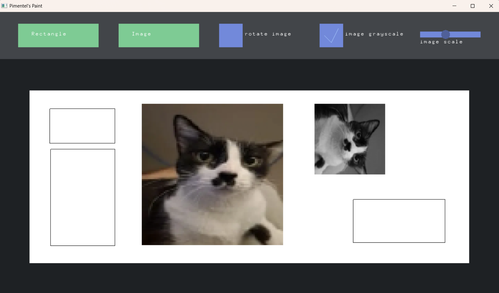

## Pimentel's Paint

#### **Funcionalidades**
O programa conta com as seguintes funcionalidades:
- Retângulos:
	- Desenhar com o mouse
	- Movimentar com o mouse
- Imagem BMP:
	- Carregar
	- Movimentar com o mouse
	- Rotacionar 90 graus
	- Deixar em tons de cinza
	- Diminuir e aumentar de tamanho

	

#### **Como usar**
- Retângulo: 
	- Desenhar: depois de clicar no botão verde "Rectangle", movimente o mouse para a área branca. Clique e segure o botão esquerdo do mouse e movimente para outra região para definir as dimensões do retângulo.
	- Movimentar: Clique e segure em qualquer área dentro do retângulo para movimenta-lo na área branca.
- Imagem:
	- Carregar: depois de clicar no botão verde "Imagem", movimente o mouse para a área branca e clique em qualquer ponto dela. Isso insere uma imagem 90x90 de um gato.
	- Movimentar: Clique e segure em qualquer área dentro da imagem para movimenta-loa na área branca.
	- Rotacionar: Clique no botão azul "rotate image" para rotacionar a última imagem adicionada 90 graus no sentido horário.
	- Tons de cinza: antes de inserir uma imagem, marque a checkbox azul "image grayscale" para tornar a próxima imagem inserida preta e branca.
	- Redimensionamento: Arraste o slider azul "image scale" para a direita para aumentar o tamanho da imagem e para esquerda para diminui-la.